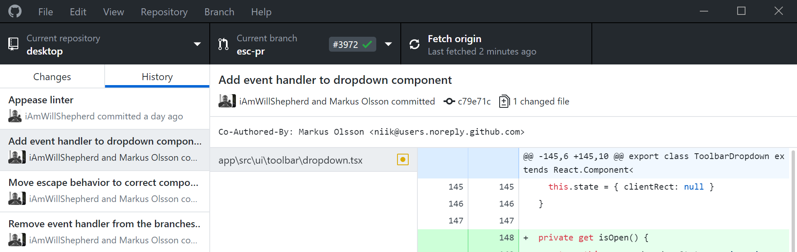
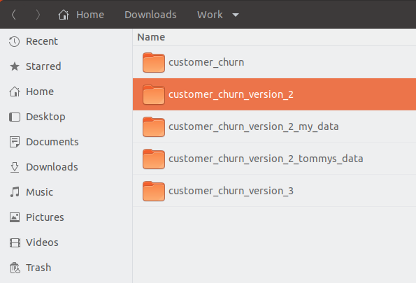
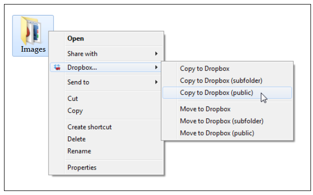

# Understanding Version Control

by Shahbaz Chaudhary

---

# GitHub as a code repository
https://github.com/pandas-dev/pandas

* Check out recent commits, notice the files changed and their diffs
* Take a look at a user who recently submitted a commit
* Check out their projects, as if you were looking to hire them

Top contributors
https://github.com/pandas-dev/pandas/graphs/contributors

Branching off and doing work
https://github.com/pandas-dev/pandas/network

---

# GitHub as a way to track issues

https://github.com/pandas-dev/pandas/issues

* Take a look at the open issues
* Take a look at closed issues and how they connect to commits

---

# GitHub as your resume?

* https://github.com/wesm
* https://github.com/hadley

---

# [Task] Let's get Git installed

https://git-scm.com/downloads

**Mac Users** Download git file, _right click_ and select open (don't double click)


Then follow prompts and keep selecting default options

Step by step instructions: https://www.linode.com/docs/development/version-control/how-to-install-git-on-linux-mac-and-windows/

---

# [Task] Configure Git (Optional)
Once installed, run the following at the command line:

```git config --global user.name examplename```

```git config --global user.email user@example.com```

---

# [Task] Install GitHub's software

https://desktop.github.com/



---

# [Task] Install VS Code

https://code.visualstudio.com/

* Install extension "python" (from Microsoft)

---

# What is the difference between Git and GitHub?

CVS -> SVN -> Git

---

# [Task] Create a GitHub account

https://github.com/

This will be your resume for many _years_, pick a good name. This is an example of a very bad name:
https://github.com/falconair

---

# [Task] Send me your GitHub user names (NOT passwords!)

https://forms.gle/wgwV1ztzFqD1Bz9x7

---

# Show Leadership

Data science departments are 5-15 years behind software engineering in professional infrastructure. Be a leader in your field by learning from programmers.

---

# Professional work vs hacking

Professional work requires more than coding and building models. Here are some _extra_ things you need to do as a professional (which are within scope of this presentation):

* Your work must be backed up. Losing your laptop must not mean losing your work
* You must be able to go back to an older version of your work
* You must be able to collaborate with your team-mates, without stepping one each other's toes

---

# How do you keep track of working model vs experiments?



---

# How do you protect against a broken laptop?


(src: https://www.labnol.org/software/send-files-to-dropbox/18438/)

---

# How do you collaborate with your colleagues?


---

# [Task] Create a new "repo" (repository)
* Create a new GitHub repository (upper right hand corner)
* Call it "PfA_test" 
* Keep it public
* Check "Initialize this repository with a README"
* Click "Create repository"
* Use command line or Desktop app to "clone" the repo to your disk

```git clone https://github.com/<yourname>/PfA_test.git```

---

# [Task] Update something in your project

Add this to readme\.md (try using vs code)
```csv
# My name is Shahbaz 

## This is a git experiment

This is some random text
```

---

# [Task] _Commit_ your code to your _local_ repo

Using VS Code, GitHub Desktop or command line, "commit" your code`

To "commit" your code means to tell Git to start keeping track of it.

Command line 

```git commit -m "Adds content to readme file"```

---

Your code is now "saved," along with a text describing the change. No need for multiple folders.

---

# [Task] _Push_ this change to GitHub 

Using VS Code, GitHub Desktop or command line, "push" your code to GitHub

Command line

```git push```

---

Your code is now 'backed-up' at a remote location

---

# [Task] Update my readme.md file and add your name

* Clone my repo `<repo name>`
* Open my readme.md file using VS Code
* Add your name to the list (don't remove anyone else's name)
* Commit code and push it

(You may get merge conflicts, VS Code makes it easier))

---

You have now learned how to 
* save various versions of your code
* back up your code
* collaborate with your colleagues

---

A couple of tools you should be aware of:
* Diff
* nb_diff

---

#References

* Mac open screenshot from https://www.linode.com/docs/development/version-control/how-to-install-git-on-linux-mac-and-windows/