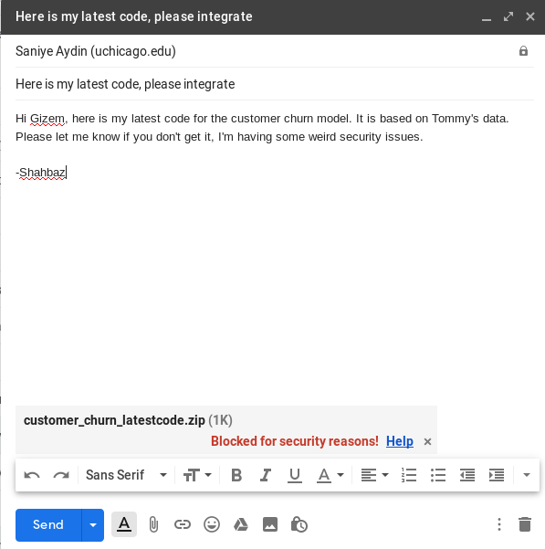

# Understanding Version Control

by Shahbaz Chaudhary

---

Let's take a quick look at GitHub
https://github.com/pandas-dev/pandas

* Check out recent commits
* Take a look at a user who recently submitted a commit
* Check out their projects, as if you were looking to hire them

Who are these people?

* https://github.com/wesm
* https://github.com/hadley

---

# [Task] Let's get Git installed

https://git-scm.com/downloads

Once installed, run the following at the command line:

```git config --global user.name examplename```

```git config --global user.email user@example.com```


---

# What is the difference between Git and GitHub?

CVS -> SVN -> Git

---

# [Task] Create a GitHub account

https://github.com/

This will be your resume for many _years_, pick a good name. This is an example of a very bad name:
https://github.com/falconair

---

# [Task] Install GitHub's software

https://desktop.github.com/

---

Data science departments are 5-15 years behind software engineering in professional infrastructure. Be a leader in your field by learning from programmers.

---


Professional work requires more than coding and building models. Here are some _extra_ things you need to do as a professional (which are within scope of this presentation):

* Your work must be backed up. Losing your laptop must not mean losing your work
* You must be able to go back to an older version of your work
* You must be able to collaborate with your team-mates, without stepping one each other's toes

---

# How do you keep track of working model vs experiments?


---

# How do you protect against a broken laptop?


(src: https://www.labnol.org/software/send-files-to-dropbox/18438/)

---

# How do you collaborate with your colleagues?



---

# [TASK] Create a new "repo"
* Create a new GitHub repository (upper right hand corner)
* Call it "PfA_test" 
* Keep it public
* Check "Initialize this repository with a README"
* Click "Create repository"
* Use command line or Desktop app to "clone" the repo to your disk

```git clone https://github.com/<yourname>/PfA_test.git```